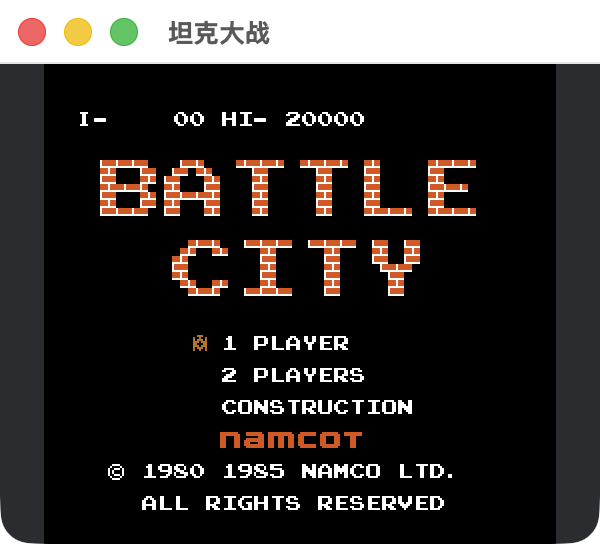
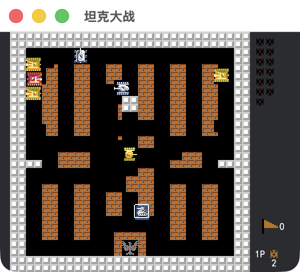
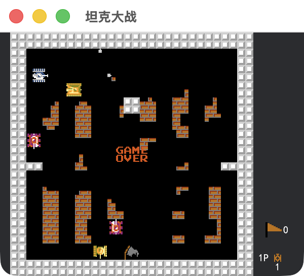

# TANKE - Bevy 坦克大战

[](https://github.com/Lai520/TANKS/actions/workflows/ci.yml)

**[在线试玩 → https://lai520.github.io/TANKS/](https://lai520.github.io/TANKS/)**

初学 rust 和 bevy，第一次使用 bevy 编写游戏，利用网络资源和小部分AI协助完成，欢迎大家设计关卡。


## 项目预览

| 开始菜单 | 游戏中 | 结算页面 |
| :---: | :---: | :---: |
|  |  |  |

## 功能

- [x] LDTK软件编辑关卡，玩家/敌人出生点都根据LDTK关卡设置。
- [x] 使用bevy-avain2d物理引擎做碰撞检测
- [x] 游戏音效
- [x] 关卡胜利结算页面
- [x] 本地多人游戏支持
- [x] 所有道具功能实现，敌人也可以拾取道具
- [x] 敌人随机行动
- [x] 代码中简单配置设置
- [ ] 游戏暂停
- [ ] 手柄控制
- [ ] 游戏结束展示玩家最高分

## 运行

1、本地运行

```
cargo run
```

加快本地编译（可选）：

```
cargo run --features dynamic
```

如果有安装 bevy-cli 使用

```
bevy run
```

运行网页版

```
bevy run web --open
```
